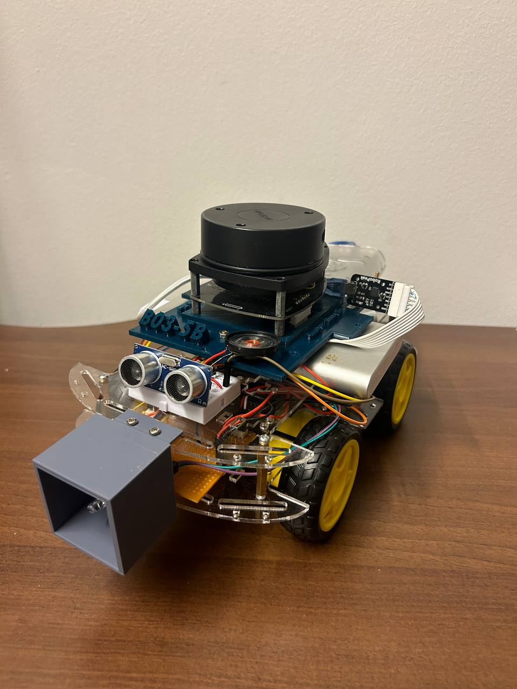
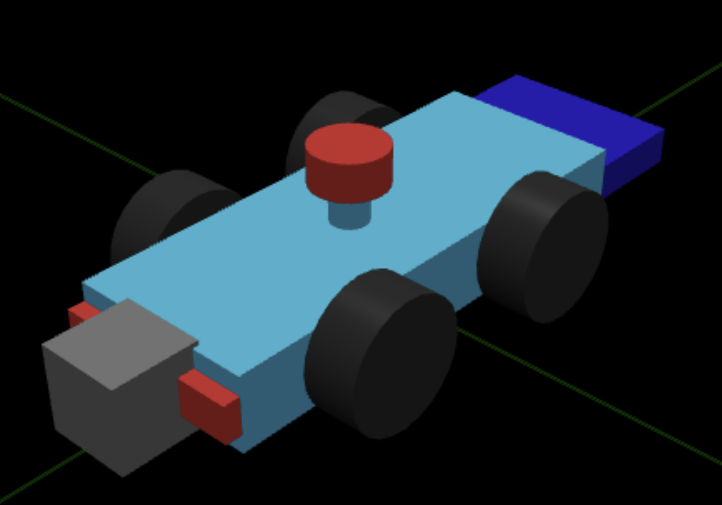
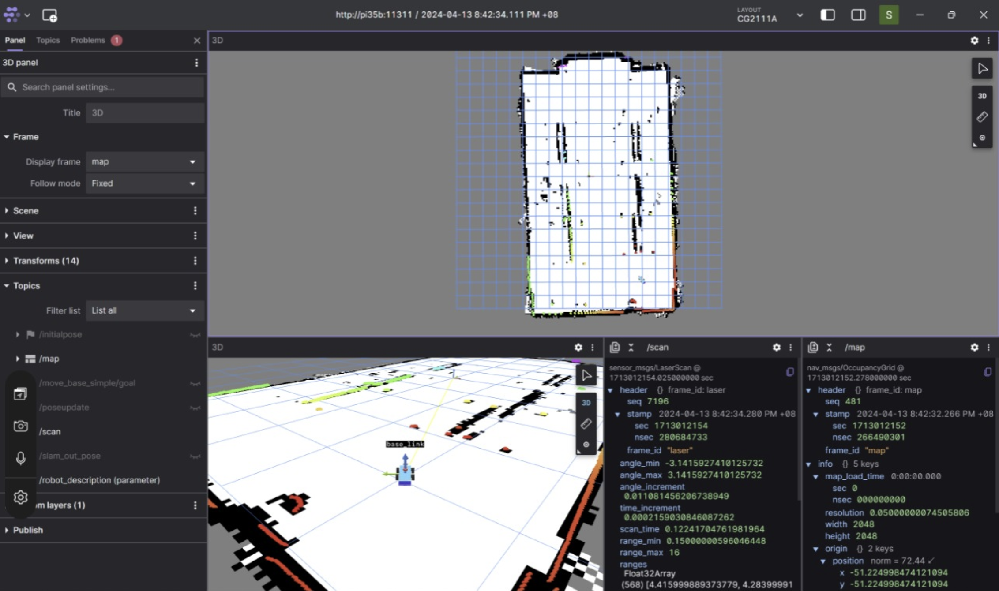
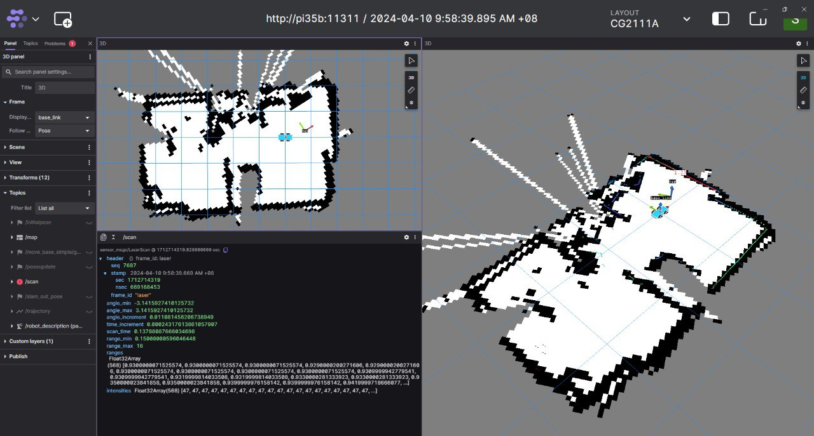
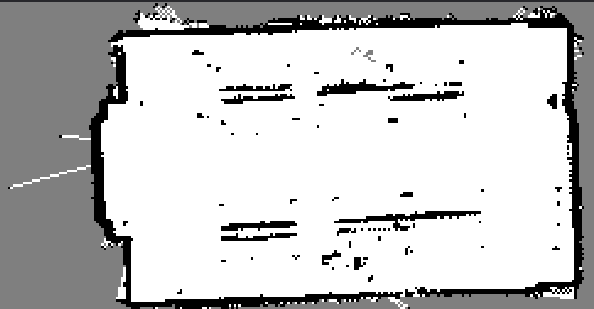

# alex_ws

This repo is the ROS1 Noetic Workspace for Alex (CG2111A).
Main functionalities include real-time map visualisation and map saving.

### Alex

Physical             |  URDF
:-------------------------:|:-------------------------:
  |  


### Visualisation
<p align="left">
 
</p>

## How to use this repo.

1) Clone Repo
```
git clone https://github.com/ShengBin-101/alex_ws.git
```
2) Init and Update Submodules (rplidar and hector_slam)
```
git submodule init
git submodule update
```
3) Build Workspace
```
catkin_make
```
4) Source built binaries
```
source devel/setup.bash
```
5) Run slam.launch file to run lidar node and hector_slam node
```
roslaunch alex slam.launch
```
---

## Lidar Setup
[Follow this guide for first time set up for lidar](https://automaticaddison.com/how-to-build-an-indoor-map-using-ros-and-lidar-based-slam/)

    sudo apt-get update
Install Dependencies

    sudo apt-get install cmake python-catkin-pkg python-empy python-nose python-setuptools libgtest-dev python-rosinstall python-rosinstall-generator python-wstool build-essential git
    sudo apt-get install qt4-qmake qt4-dev-tools

Change permissions for lidar's port

    sudo chmod 666 /dev/ttyUSB0
---
## Map Server for saving of maps

Install Map server and create maps directory to hold maps.
    
    sudo apt-get install ros-noetic-map-server
    mkdir ~/alex_ws/maps

### Saving map
    
    cd ~/alex_ws/maps
    rosrun map_server map_saver -f <map_name>

### Loading map
On one terminal run

    roscore
On another terminal

    cd ~/alex_ws/maps
    rosrun map_server map_server my_map.yaml
Map can be viewed on RVIZ

    rviz

Map can also be viewed on foxglove. Look at below section for foxglove.

---
## Visualisation using foxglove

Foxglove allows you to visualize topics broadcasted by the Pi, provided you are connected to the same network.
Make sure foxglove is installed on pi.

### Download and Install Foxglove Studio Desktop on your LAPTOP
[Download Foxglove Studio here](https://foxglove.dev/download)

### Install Foxglove (if haven't done so ON THE PI):
```
    sudo apt install ros-noetic-foxglove-bridge
```

Start foxglove websocket:
```
    roslaunch --screen foxglove_bridge foxglove_bridge.launch port:=8765
```

Open up foxglove application on your laptop (make sure you are in same network as pi)

> [!NOTE]
> Click on "open connection"
> Under "Foxglove Websocket", enter ws://ip-address-of-pi:8765 for Websocket URL


TLS can be enabled, just need add path to certificates.
More info here: https://github.com/foxglove/ros-foxglove-bridge

### Example of foxglove with rviz.launch (to visualize alex model)
https://github.com/ShengBin-101/alex_ws/assets/52733750/96dabaaf-2b83-4652-9c23-fc2892bac013

---
## Real-time Map Visualisation
### Process is automated in tmux script on alex, simply run

    ./start_tmux.sh

### However, if you have no tmux, perform the following:
1. Run master node

        roscore

2. Open two terminals, one for lidar and one for slam.

3. On "lidar" terminal run

        roslaunch alex lidar.launch
    
4. On "slam" terminal run 

        roslaunch alex slam.launch

5. Open Foxglove Desktop Application and connect to ROS_MASTER_URI.

---
Some Results

Scan of my room             |  Map of a random Seminar Room in my hostel :)
:-------------------------:|:-------------------------:
  |  


